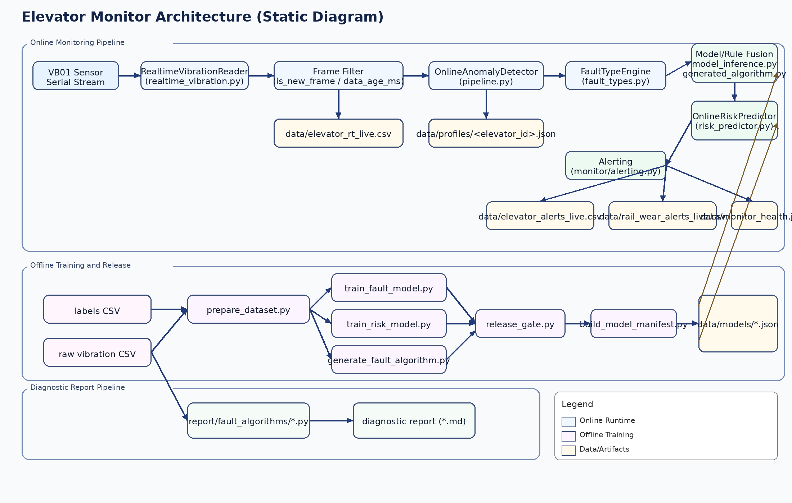
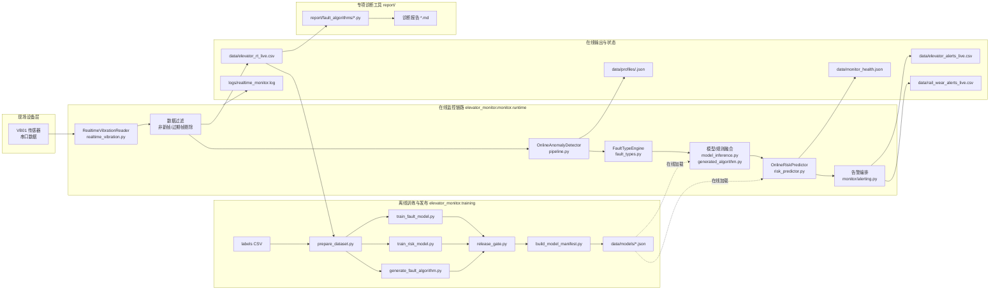

# Elevator Monitor

电梯振动监控与诊断项目，覆盖三条链路：
- 在线监控链路：串口采集 -> 异常检测 -> 故障规则/模型融合 -> 风险预警 -> 告警落盘
- 离线训练链路：数据集构建 -> 故障/风险模型训练 -> 发布门槛检查
- 专项诊断链路：对单个或批量振动 CSV 执行规则算法并生成诊断报告

## 架构图
静态图（推荐直接查看）：



Mermaid 源图：



如果当前预览器不支持 Mermaid，可看下面这份纯文本架构图：

```text
[VB01 传感器/串口]
        |
        v
[RealtimeVibrationReader]
        |
        v
[数据过滤: is_new_frame/data_age_ms]
        |
        +------------------------------> [data/elevator_rt_live.csv]
        |
        v
[OnlineAnomalyDetector]
        |
        v
[FaultTypeEngine]
        |
        v
[模型/规则融合: model_inference + generated_algorithm] <---- [data/models/*.json]
        |
        v
[OnlineRiskPredictor] <-------------------------------------- [data/models/*.json]
        |
        v
[Alerting]
   |            |                    |
   v            v                    v
[elevator_   [rail_wear_         [monitor_health.json]
alerts.csv]  alerts.csv]

离线训练链路:
[原始CSV + labels] -> [prepare_dataset] -> [train_fault/train_risk/generate_algo]
-> [release_gate] -> [build_model_manifest] -> [data/models/*.json] -> (在线加载)

专项诊断链路:
[振动CSV] -> [report/fault_algorithms/*.py] -> [诊断报告 *.md]
```

常见原因：IDE 的 Markdown 预览未启用 Mermaid 渲染（不是文档内容丢失）。

## 核心能力
### 在线监控（生产可运行）
- 串口实时采集（VB01），支持断线自动重连、无数据超时重连、首帧超时保护
- 数据有效性过滤（`is_new_frame`、`data_age_ms`）
- 在线异常检测（滑动基线 + z-score）
- 规则故障识别（如 `sensor_missing`、`signal_frozen`、`impact_shock`、`rail_wear_*`、`temperature_*`）
- 24h 风险预测（支持 predictive-only 告警）
- 模型融合（监督模型 + 生成算法，置信度不足自动回退规则）

### 离线训练与上线闭环
- 原始数据 + 标签构建训练集
- 故障分类模型训练、风险模型训练、少样本故障算法生成
- Release Gate 校验（准确率/召回/样本支撑）
- Manifest 版本清单

### 专项诊断
- `report/fault_algorithms` 支持 8 类故障规则算法
- 可对单个 CSV 或批量 CSV 进行离线诊断
- 支持时间序列确认（如松绳连续窗口确认）

## 目录结构（重点）
```text
.
├── elevator_monitor/
│   ├── api/                     # FastAPI 后端（main / routers / schemas）
│   ├── monitor/                 # 在线运行时（args/constants/pipeline/runtime/alerting）
│   ├── training/                # 离线训练、评估、发布工具
│   ├── api_service.py           # FastAPI 兼容入口（转发到 api/）
│   ├── realtime_monitor.py      # 在线监控入口（兼容入口）
│   └── realtime_vibration.py    # 实时振动读取 SDK + CLI
├── report/
│   ├── fault_algorithms/        # 专项故障算法（机械松动/钢丝绳松动等）
│   ├── wire_looseness_index.py  # 保留的历史松绳实验工具（可选）
│   └── *.md                     # 诊断报告
├── deploy/
│   ├── docker-compose.monitor.yml
│   └── docker.monitor.env.example
├── data/
├── logs/
└── tests/
```

## 运行环境
- Python 3.8+
- Linux 串口访问权限（如 `/dev/ttyUSB0`）
- 依赖：

```bash
pip install -r requirements.txt
```

## 快速开始
### 1) 本地运行在线监控
```bash
python -m elevator_monitor.realtime_monitor \
  --elevator-id elevator-001 \
  --port /dev/ttyUSB0 \
  --baud 115200 \
  --addr 0x50 \
  --sample-hz 100 \
  --output-data data/elevator_rt_live.csv \
  --output-alert data/elevator_alerts_live.csv \
  --output-rail-wear-alert data/rail_wear_alerts_live.csv \
  --health-path data/monitor_health.json \
  --log-file logs/realtime_monitor.log
```

### 2) 只做实时振动读取（CLI/SDK）
```bash
python -m elevator_monitor.realtime_vibration \
  --elevator-id elevator-001 \
  --port /dev/ttyUSB0 \
  --sample-hz 100 \
  --limit 10
```

按固定 100Hz 输出（含 `is_new_frame` 标记）：
```bash
python -m elevator_monitor.realtime_vibration \
  --port /dev/ttyUSB0 \
  --emit-mode fixed \
  --emit-hz 100 \
  --duration-s 30 \
  --output-csv data/vibration_fixed_100hz.csv \
  --format csv > /dev/null
```

SDK 示例：
```python
from elevator_monitor import RealtimeVibrationReader

with RealtimeVibrationReader(
    elevator_id="elevator-001",
    port="/dev/ttyUSB0",
    baud=115200,
    addr=0x50,
    sample_hz=100.0,
) as reader:
    frame = reader.read_latest(wait_timeout_s=2.0)
    print(frame)
```

### 3) Docker 部署（推荐）
```bash
cp deploy/docker.monitor.env.example deploy/docker.monitor.env
# 根据现场修改 deploy/docker.monitor.env

docker compose \
  --env-file deploy/docker.monitor.env \
  -f deploy/docker-compose.monitor.yml \
  up -d --build
```

常用命令：
```bash
docker compose -f deploy/docker-compose.monitor.yml logs -f
docker compose -f deploy/docker-compose.monitor.yml ps
docker compose -f deploy/docker-compose.monitor.yml down
```

### 4) 启动统一 API（供 Dify / 工单系统调用）
```bash
python -m elevator_monitor.api_service --host 0.0.0.0 --port 8000
```

核心接口：
- `GET /api/v1/health/monitor`：读取监控健康状态并校验时效
- `POST /api/v1/diagnostics/rule-engine`：执行 8 类规则诊断，支持 `rows`、`csv_text` 或 `csv_path`
- `POST /api/v1/workflows/maintenance-package`：生成维保工单包，返回 `dify_inputs`
- `POST /api/v1/workflows/diagnosis-report`：聚合“诊断结果 + 维保包”并输出 `dify_report_inputs`（供 Dify 生成报告）

Dify 接法：
- 直接用 HTTP Request 节点调用上述接口即可，不要求每个算法单独做一个脚本入口
- 更合理的方式是“算法服务统一对外暴露 JSON API”，由 Dify 只负责编排、通知、知识库和工单流转
- 如果要由监控服务主动触发 Dify，再去调用 Dify 的 Workflow API；这时可以是“主动调用 API”，不要求你一定做 webhook
- 标准节点输入输出设计见 `docs/dify_workflow_design.md`

## 离线训练与发布
### 1) 准备标签
参考 `examples/labels_template.csv`，至少包含：
- `elevator_id`
- `start_ts_ms`
- `end_ts_ms`（可选）
- `fault_type`
- `confirmed`

### 2) 构建训练集
```bash
python -m elevator_monitor.training.prepare_dataset \
  --data-glob "data/*.csv" \
  --label-csv examples/labels_template.csv \
  --output data/train_dataset.csv \
  --window-s 10 \
  --step-s 5 \
  --horizon-s 86400 \
  --min-samples 20
```

说明：
- 训练集会自动写出 `source_file` 列，后续训练默认按采集文件分组切分训练/验证集，避免同一份采样窗口同时落入两侧导致验证指标虚高。

### 3) 训练故障模型
```bash
python -m elevator_monitor.training.train_fault_model \
  --dataset-csv data/train_dataset.csv \
  --output-model data/models/fault_model.json \
  --min-class-samples 8 \
  --normal-max-ratio 5
```

### 4) 训练风险模型
```bash
python -m elevator_monitor.training.train_risk_model \
  --dataset-csv data/train_dataset.csv \
  --output-model data/models/risk_model.json \
  --min-class-samples 20 \
  --negative-max-ratio 4
```

### 5) 生成少样本故障算法（可选）
```bash
python -m elevator_monitor.training.generate_fault_algorithm \
  --dataset-csv data/train_dataset.csv \
  --output-json data/models/generated_fault_algo.json \
  --target-column target_fault_type \
  --normal-label normal
```

### 6) Release Gate（上线前）
```bash
python -m elevator_monitor.training.release_gate \
  --model-json data/models/fault_model.json \
  --expected-task fault_type \
  --min-accuracy 0.70 \
  --min-macro-f1 0.65 \
  --min-support 100
```

### 7) 构建模型 Manifest
```bash
python -m elevator_monitor.training.build_model_manifest \
  --model-json data/models/fault_model.json \
  --model-json data/models/risk_model.json \
  --output data/models/manifest.json \
  --project elevator-monitor \
  --environment prod \
  --created-by ops
```

### 8) 生成维保闭环工单包（Dify/运维编排输入）
```bash
python -m elevator_monitor.maintenance_workflow \
  --alert-csv data/elevator_alerts_live.csv \
  --health-json data/monitor_health.json \
  --manifest-json data/models/manifest.json \
  --site-name "Building-A" \
  --output-json data/workflow/maintenance_package.json \
  --output-md data/workflow/maintenance_package.md
```

输出结果包含：
- 面向值班/维保的优先级、处置模式、推荐动作、备件建议
- `dify_inputs` 字段，可直接作为 Dify Workflow 的结构化入参
- Markdown 版值班报告，便于钉钉/企业微信/工单系统直接引用

## 专项诊断（report/fault_algorithms）
单算法示例（钢丝绳松动）：
```bash
python3 report/fault_algorithms/detect_rope_looseness.py \
  --input report/vibration_30s_20260303_110622.csv --pretty
```

一次输出 8 类结果：
```bash
python3 report/fault_algorithms/run_all.py \
  --input report/vibration_30s_20260303_110622.csv --pretty
```

松绳时间序列确认：
```bash
python3 report/fault_algorithms/rope_looseness_timeline.py \
  --input-dir report \
  --start-hhmm 1016 \
  --end-hhmm 1057 \
  --min-score 60 \
  --confirm-windows 2 --pretty
```

## 在线输出文件
- `data/elevator_rt_live.csv`：原始实时数据
- `data/elevator_alerts_live.csv`：告警结果（含模型调试字段）
- `data/rail_wear_alerts_live.csv`：导轨磨损趋势 8 列结果
- `data/monitor_health.json`：运行健康状态
- `data/alert_context/*.csv`：告警前上下文切片
- `data/workflow/*.json|*.md`：维保闭环工单包（可选，由 `maintenance_workflow` 生成）
- `data/profiles/{elevator_id}.json`：分梯画像（基线持久化）
- `logs/realtime_monitor.log`：服务日志

## 关键环境变量（常用）
完整变量见 `deploy/docker.monitor.env.example`，常用项：
- 串口与采样：`MONITOR_PORT`、`MONITOR_BAUD`、`MONITOR_ADDR`、`MONITOR_SAMPLE_HZ`
- 输出路径：`MONITOR_OUTPUT_DATA`、`MONITOR_OUTPUT_ALERT`、`MONITOR_OUTPUT_RAIL_WEAR`
- 规则阈值：`MONITOR_FAULT_VIBRATION_WARNING_Z`、`MONITOR_FAULT_VIBRATION_SHOCK_Z`
- 融合模式：`MONITOR_FAULT_FUSION_MODE=rule_primary|model_primary`
- 模型路径：`MONITOR_FAULT_MODEL_PATH`、`MONITOR_GENERATED_ALGO_PATH`、`MONITOR_RISK_MODEL_PATH`
- 风险预测：`MONITOR_RISK_ENABLED`、`MONITOR_RISK_EMIT_ON_NORMAL`、`MONITOR_RISK_EMIT_MIN_LEVEL`
- Dify主动回调：`MONITOR_DIFY_ENABLED`、`MONITOR_DIFY_BASE_URL`、`MONITOR_DIFY_API_KEY`、`MONITOR_DIFY_MIN_LEVEL`

## 数据接入最小字段（100Hz）
必需字段：
- `elevator_id, ts_ms, ts, Ax, Ay, Az, Gx, Gy, Gz, t`

可选字段（用于增强特征）：
- `vx, vy, vz, ax, ay, az, sx, sy, sz, fx, fy, fz`

## 回归检查
```bash
python check_project.py
```

## 当前能力边界
- 已具备：异常检测、风险预警、规则故障识别、轻量模型融合、上线闭环工具
- 尚不具备：无标签条件下的高可信部件级精细分类
- 建议：先在线采数 + 标签闭环，再持续迭代模型与阈值
