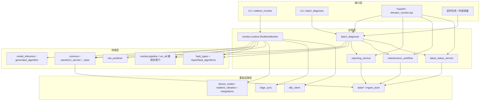

# Demo 阶段架构

这份文档不是“理想化重构方案”，而是基于当前仓库已经存在的代码，整理出一套适合 demo 阶段继续演进的架构边界。

目标只有四个：

1. 把现有三条链路讲清楚，避免功能越做越散。
2. 先稳定主链路，不急着做大规模目录迁移。
3. 保留当前电梯监控、训练、报告流程和已有输出契约。
4. 为后续从 demo 走向可部署版本留出升级路径。

## 一句话架构

当前项目建议按“四层 + 三条链路”理解：

- 接口层：CLI、FastAPI、定时任务入口。
- 应用层：批诊断、报告生成、维保工单打包、最新状态聚合。
- 领域层：特征提取、异常门、钢丝绳/橡胶圈规则、风险与模型融合。
- 基础设施层：设备采集、文件存储、边缘同步、Dify 集成。

三条链路分别是：

- 在线监控链路：实时采集并产出在线告警。
- 批诊断主链路：对 CSV/切窗结果做统一诊断并沉淀最新状态。
- 训练发布链路：把历史数据变成模型和发布清单。

## Demo 主架构图



## 三条链路怎么分

### 1. 在线监控链路

职责：

- 从传感器或串口持续读取实时数据。
- 执行在线异常检测、故障识别、风险评估。
- 生成在线告警、健康状态、上下文数据。

当前入口：

- `python -m elevator_monitor.realtime_monitor`
- 核心实现在 `elevator_monitor/monitor/runtime.py`

核心模块：

- `elevator_monitor/monitor/`
- `elevator_monitor/realtime_vibration.py`
- `elevator_monitor/device_model.py`
- `elevator_monitor/fault_types.py`
- `elevator_monitor/model_inference.py`
- `elevator_monitor/generated_algorithm.py`
- `elevator_monitor/risk_predictor.py`

适用场景：

- 现场设备联调
- 实时采集演示
- 告警链路验证

### 2. 批诊断主链路

职责：

- 对单个或批量 CSV 做统一诊断。
- 先做相对健康基线异常门，再做保守归因。
- 汇总连续窗口结果，生成 `latest_status.json` 和历史记录。
- 作为当前 demo 阶段推荐的状态主链路。

当前入口：

- `python -m elevator_monitor.batch_diagnosis`

核心模块：

- `elevator_monitor/batch_diagnosis.py`
- `report/fault_algorithms/run_all.py`
- `report/fault_algorithms/fault_detectors.py`
- `elevator_monitor/latest_status_service.py`
- `elevator_monitor/waveform_service.py`
- `elevator_monitor/reporting_service.py`
- `elevator_monitor/maintenance_workflow.py`

适用场景：

- 离线样本演示
- 规则策略验证
- API 对外查询当前状态

### 3. 训练发布链路

职责：

- 从历史 CSV 和标签构建训练集。
- 训练故障模型、风险模型和辅助算法。
- 执行发布门槛检查并生成模型清单。

当前入口：

- `python -m elevator_monitor.training.prepare_dataset`
- 其他训练 CLI 位于 `elevator_monitor/training/`

核心模块：

- `elevator_monitor/training/prepare_dataset.py`
- `elevator_monitor/training/train_fault_model.py`
- `elevator_monitor/training/train_risk_model.py`
- `elevator_monitor/training/generate_fault_algorithm.py`
- `elevator_monitor/training/release_gate.py`
- `elevator_monitor/training/build_model_manifest.py`

适用场景：

- 离线训练
- 算法迭代
- 版本发布准备

## 推荐的职责边界

### 接口层

只负责“接请求”和“调应用服务”，不直接写算法。

当前对应：

- `elevator_monitor/api/`
- `elevator_monitor/realtime_monitor.py`
- `elevator_monitor/api_service.py`
- 外部 cron / Docker Compose / shell 脚本

约束建议：

- `api/routers/` 只保留参数解析、错误码、调用服务。
- CLI 入口只保留参数解析和启动，不堆业务逻辑。
- 兼容入口继续保留薄封装，避免调用方断裂。

### 应用层

负责“串业务流程”，不沉淀具体算法细节。

当前对应：

- `elevator_monitor/batch_diagnosis.py`
- `elevator_monitor/reporting_service.py`
- `elevator_monitor/maintenance_workflow.py`
- `elevator_monitor/latest_status_service.py`
- `elevator_monitor/waveform_service.py`

约束建议：

- 应用层可以组合多个领域模块。
- 应用层负责组织输入输出契约，比如 `latest_status.json`、Markdown 报告、维保包。
- 应用层不要再直接长出新的底层设备读写代码。

### 领域层

负责“怎么判断异常、怎么归因、怎么算风险”，是项目的核心资产。

当前对应：

- `elevator_monitor/common.py`
- `elevator_monitor/monitor/pipeline.py`
- `elevator_monitor/fault_types.py`
- `elevator_monitor/model_inference.py`
- `elevator_monitor/generated_algorithm.py`
- `elevator_monitor/risk_predictor.py`
- `report/fault_algorithms/`

约束建议：

- 领域层尽量少依赖文件路径和 HTTP 细节。
- 规则参数集中到少量配置对象，不继续散落字面量。
- `report/fault_algorithms/` 继续作为统一决策层，不把最终用户结论分散回多个入口。

### 基础设施层

负责“怎么连设备、怎么存文件、怎么对外同步”。

当前对应：

- `elevator_monitor/device_model.py`
- `elevator_monitor/realtime_vibration.py`
- `elevator_monitor/integrations/`
- `elevator_monitor/edge_sync.py`
- `elevator_monitor/ingest_store.py`
- `elevator_monitor/dify_client.py`
- `data/`
- `deploy/`

约束建议：

- 设备接入、云端同步、文件落盘都视为基础设施能力。
- 基础设施层应该被应用层调用，不反向依赖领域层细节。

## 当前目录应该怎么理解

```text
elevator_monitor/
├── api/                     # HTTP 接口层
├── monitor/                 # 在线监控运行时
├── training/                # 训练发布链路
├── *_service.py             # 应用层编排服务
├── batch_diagnosis.py       # 批诊断应用入口
├── common.py                # 共享特征/解析
├── fault_types.py           # 在线规则识别
├── model_inference.py       # 模型推理与融合
├── generated_algorithm.py   # 生成式规则/预测辅助
├── risk_predictor.py        # 风险预测
├── device_model.py          # 设备访问
├── realtime_vibration.py    # 采集 SDK/CLI
├── edge_sync.py             # 边缘同步
└── ingest_store.py          # 本地云侧落盘

report/
├── fault_algorithms/        # 批诊断统一决策层
└── report_results/          # 报告产物

data/
├── captures/                # 原始或切窗采集数据
├── baselines/               # 健康基线
├── diagnosis/               # 最新状态和历史状态
└── models/                  # 训练发布产物
```

## Demo 阶段推荐的开发规则

为了避免 demo 阶段越做越乱，建议后续改动统一遵守下面几条：

1. 新 HTTP 接口只放到 `elevator_monitor/api/routers/`。
2. 新的流程编排优先放到 `elevator_monitor/*_service.py` 或独立应用模块，不直接塞进 router。
3. 新诊断规则优先放到 `report/fault_algorithms/`，保持统一决策出口。
4. 在线监控特有逻辑放到 `elevator_monitor/monitor/`，不要和批诊断逻辑混写。
5. 新训练能力只放到 `elevator_monitor/training/`。
6. 领域算法优先做纯函数或轻状态对象，减少对文件和网络的耦合。
7. 兼容入口可以保留，但核心实现只保留一份。

## 现在不建议做的事

demo 阶段先不要做这些高成本动作：

- 不要拆成多微服务。
- 不要为了“看起来规范”做全仓库大迁移。
- 不要把规则、模型、报告逻辑同时塞进 router 或 CLI。
- 不要默认引入数据库；目前文件存储足够支撑 demo。
- 不要把橡胶圈规则重新并回主判链路，除非需求明确变更。

## 建议的后续演进顺序

### Phase 1：先统一认知

马上可做：

- 按本文档理解模块归属。
- 新需求优先走“接口层 -> 应用层 -> 领域层”的调用方向。
- 所有对外状态统一围绕 `latest_status.json` 和历史记录沉淀。

### Phase 2：小步收口

当模块继续增多时，建议逐步新增概念目录，而不是一次性搬家：

- `elevator_monitor/application/`
- `elevator_monitor/domain/`
- `elevator_monitor/infra/`

做法是新代码先进新目录，旧代码按需求触达时再迁。

### Phase 3：走向可部署版本

如果后面从 demo 变成长期运行系统，再考虑：

- 把 `ingest_store` 换成对象存储或数据库。
- 把批诊断调度从本地 cron 升级为任务队列。
- 把模型与规则配置做版本化发布。
- 把边缘端和云端接口契约固定下来。

## 当前最推荐的 demo 演示路径

如果目的是稳定演示，而不是压测生产能力，建议主流程固定为：

1. 采集或准备 CSV 到 `data/captures/`
2. 准备健康基线到 `data/baselines/`
3. 运行 `batch_diagnosis`
4. 生成 `data/diagnosis/latest_status.json`
5. 通过 API 查询最新状态、波形和报告草稿

这样做的好处是：

- 最容易复现
- 最容易解释给业务方
- 最符合当前保守诊断策略
- 不依赖现场设备持续在线

## 结论

这个项目在 demo 阶段不需要“大而全”的企业架构，更需要一个稳定的主链路和清晰的边界。

最实用的做法是：

- 保持三条链路并存
- 把批诊断作为当前 demo 主链路
- 把 API 当展示与编排层
- 把 `report/fault_algorithms/` 继续当统一决策层
- 后续只做小步收口，不做大爆炸式重构
